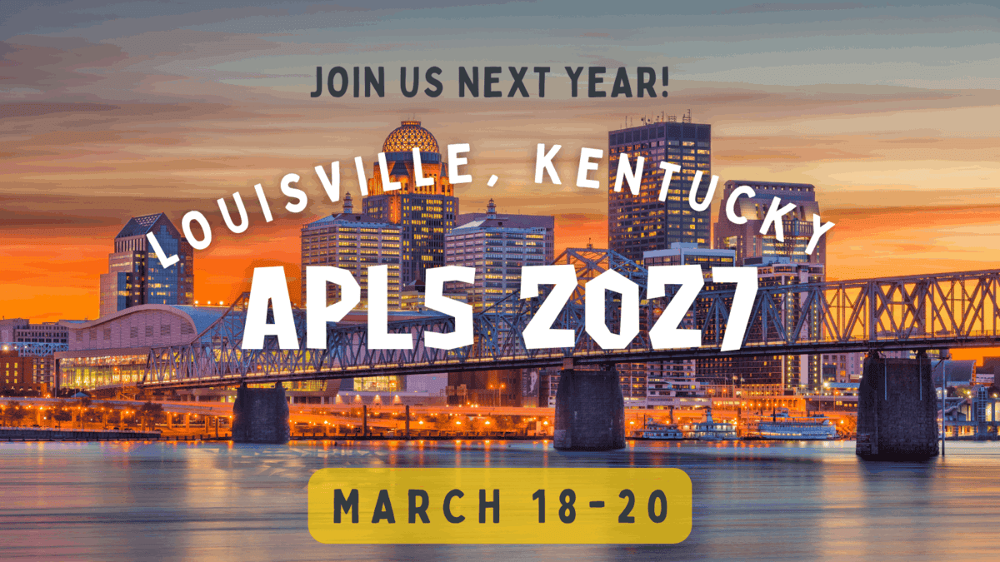
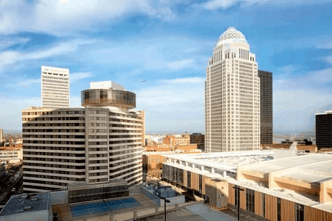

```{r setup, include=FALSE}
knitr::opts_chunk$set(echo = TRUE)
library(aplsr)     # rowwise_table()
library(htmltools) # div(), tags$*, a(), span()
library(purrr)     # pmap()
library(stringr)   # str_c()

# Conference facts and rates come from conferences/data/*.csv, which
# conferences/_update-conference.R refreshes from the conference Google
# Sheet. Edit the Sheet and re-run that script; do not edit the values here.
library(readr)
data_dir <- file.path(dirname(knitr::current_input(dir = TRUE)), "data")
conf_info <- read_csv(file.path(data_dir, "info.csv"),
                      col_types = cols(.default = "c"), show_col_types = FALSE)
info <- setNames(as.list(conf_info$value), conf_info$key)
info <- lapply(info, function(x) if (is.na(x)) "" else x)
rates <- read_csv(file.path(data_dir, "registration-rates.csv"),
                  col_types = cols(.default = "c"), show_col_types = FALSE)

# Derive CFP status for the banner
# Priority: if submission_portal_url is set → "open"
#           if cfp_deadline is in the past → "closed"
#           otherwise → "upcoming"
cfp_status <- "upcoming"
if (nzchar(info$submission_portal_url)) {
  cfp_status <- "open"
} else if (nzchar(info$cfp_deadline)) {
  deadline <- as.Date(info$cfp_deadline, optional = TRUE)
  if (!is.na(deadline) && deadline < Sys.Date()) {
    cfp_status <- "closed"
  }
}
```

:::::: column-screen
::::: hero-banner
:::: content-block
::: heading-guard
:::
# 2027 Annual Conference of the American Psychology-Law Society {.h4}

[ Louisville, KY]{.h5}

[ March 18-20, 2027]{.h5}

```{r hero-buttons}
#| echo: false
#| results: asis

# Build hero buttons dynamically based on what info is available
hero_btns <- character(0)

if (cfp_status == "open" && nzchar(info$submission_portal_url)) {
  hero_btns <- c(hero_btns,
    sprintf('[Submit a Proposal ](%s){.btn-action .btn .btn-action-primary .btn-lg role="button"}',
            info$submission_portal_url))
}
if (nzchar(info$registration_url)) {
  hero_btns <- c(hero_btns,
    sprintf('[Register ](%s){.btn-action .btn .btn-secondary .btn-lg role="button"}',
            info$registration_url))
}

if (length(hero_btns) > 0) {
  cat("::: hero-buttons\n")
  cat(paste(hero_btns, collapse = "\n"), "\n")
  cat(":::\n")
}
```

::::
:::::
::::::

::: {.column-screen}
::: {.alt-background-blue}

```{r toc}
#| echo: false
#| warning: false
#| message: false

# Five navigation items — Hotel and Archives are now inside tabset sections
content <- rowwise_table(
  ~name, ~icon, ~link,
  "General", "info-circle", "#info",
  "Proposals", "send", "#proposals",
  "Registration", "person-add", "#registration",
  "Schedule", "person-workspace", "#schedule",
  "Workshops", "easel", "#preconference"
)

div(
  div(
    class = "bg-breakout",
    div(
      class = "inner-container",
      div(
        class = "boxed-wrapper",
        div(
          class = "boxed-feature-grid",
          pmap(content, \(name, icon, link) {
            div(
              class = "boxed-feature-grid__item",
              div(
                class = "boxed-feature-grid__icon",
                a(
                  href = link, 
                  class = "boxed-feature-grid__link",
                  `aria-label` = name,
                  tags$i(class = str_c("bi-", icon, " boxed-feature-grid__i"))
                )
              ),
              div(class = "boxed-feature-grid__title", name)
            )
          })
        )
      )
    )
  )
)
```
:::
:::

::: vspace
:::

## General Information {#info}

::: {.panel-tabset .box-shadow}

###  Conference

> If you have any questions or comments about the conference, please contact the conference co-chairs at [conference\@ap-ls.org](mailto:conference@ap-ls.org)  
> Looking forward to seeing everyone in March!
>
> — **2027 AP-LS Conference Co-Chairs**

{fig-alt="2027 AP-LS Conference logo"}

###  Hotel

::: vspace
:::

{fig-align="center" fig-alt="Exterior photograph of the Marriott Louisville Downtown hotel building in Louisville, Kentucky"}

::: vspace
:::

[The 2027 AP-LS Conference will be held at the [Louisville Marriott Downtown](https://www.gotolouisville.com/directory/louisville-marriott-downtown/)]{.h6}

**Location:** 280 W Jefferson St, Louisville, KY 40202

```{r}
#| echo: false
#| results: asis
# Room block: when hotel_booking_url is set in the Sheet, the booking
# callout appears; until then the note shows on its own.
if (nzchar(info$hotel_booking_url)) {
  cat(
    '::: {.callout-important}',
    '### AP-LS Room Block!',
    '',
    info$hotel_note,
    '',
    sprintf('[Book Room ](%s){.btn-action .btn .btn-secondary .btn-lg role="button"}',
            info$hotel_booking_url),
    ':::',
    sep = "\n"
  )
} else {
  cat(
    '::: simple-info-center',
    '',
    paste0('[', info$hotel_note, ']{.h5}'),
    '',
    ':::',
    sep = "\n"
  )
}
```

:::

::: vspace
:::

---

::: vspace
:::

## Submissions {#proposals}

::: {.panel-tabset .box-shadow}

###  Overview

```{r cfp-banner}
#| echo: false
#| results: asis

# CFP status banner — styled callout based on derived status
if (cfp_status == "open") {
  cat(
    '::: {.callout-important appearance="minimal"}',
    '### Call for Proposals is Open',
    '',
    sprintf('**Deadline:** %s', ifelse(nzchar(info$cfp_deadline), info$cfp_deadline, "See submission portal for deadline")),
    '',
    info$submissions_note,
    '',
    sprintf('[Submit a Proposal ](%s){.btn-action .btn .btn-action-primary .btn-lg role="button"}',
            info$submission_portal_url),
    ':::\n',
    sep = "\n"
  )
} else if (cfp_status == "closed") {
  cat(
    '::: {.callout-note appearance="minimal"}',
    '### Call for Proposals is Closed',
    '',
    'Submissions are no longer being accepted. Thank you to everyone who submitted!',
    '',
    sprintf('[View CFP Details ](cfp/index.qmd){.btn-action .btn .btn-secondary .btn-lg role="button"}'),
    ':::\n',
    sep = "\n"
  )
} else {
  # upcoming
  cat(
    '::: {.callout-tip appearance="minimal"}',
    '### Call for Proposals Coming Soon',
    '',
    info$submissions_note,
    '',
    sprintf('[View CFP Details ](cfp/index.qmd){.btn-action .btn .btn-secondary .btn-lg role="button"}'),
    ':::\n',
    sep = "\n"
  )
}
```

###  Details

::: vspace
:::

::: simple-info-center

[`r info$cfp_note`]{.h5}

[Full CFP Details ](cfp/index.qmd){.btn-action .btn .btn-secondary .btn-lg role="button"}

:::

::: vspace
:::

:::

::: vspace
:::

---

::: vspace
:::

## Schedule {#schedule}

::: {.panel-tabset .box-shadow}

###  Overview

::: simple-info-center

[`r ifelse(nzchar(info$schedule_preview), info$schedule_preview, info$schedule_note)`]{.h5}

:::

###  At a Glance

::: {.alt-background-blue}
::: content-block-blue

#### Conference at a Glance

::: {.grid .grid-three}

::: {.grid__item}
##### Thursday, March 18

- Preconference Workshops
- Evening Welcome Reception
:::

::: {.grid__item}
##### Friday, March 19

- Morning Plenary
- Paper & Symposium Sessions
- Evening Poster Session
:::

::: {.grid__item}
##### Saturday, March 20

- Morning Paper & Symposium Sessions
- Data Blitz
- Closing Events
:::

:::

:::
:::

:::

::: vspace
:::

---

::: vspace
:::

## Registration {#registration}

::: {.panel-tabset .box-shadow}

###  Info

::: vspace
:::

::: simple-info-center

[`r info$registration_note`]{.h5}

```{r}
#| echo: false
#| results: asis
if (nzchar(info$registration_url)) {
  cat(
    sprintf("[Register ](%s){.btn-action .btn .btn-action-primary .btn-lg role=\"button\"}",
            info$registration_url)
  )
}
```

:::

::: vspace
:::

###  Pricing

::: vspace
:::

::: {.callout-note appearance="simple"}
### Registration Rates & Inclusions

*`r info$rates_note`*

```{r}
#| echo: false
#| results: asis
cat(knitr::kable(rates,
                 col.names = c("Status", "Early Bird (before Jan 31)",
                               "Regular (after Feb 1)"),
                 align = "lcc"),
    sep = "\n")
```
:::

:::

::: vspace
:::

---

::: vspace
:::

## Preconference Workshops {#preconference}

::: {.panel-tabset .box-shadow}

###  About

[[ Wednesday, March 17, 2027]{.highlight}]{.h6}

*Attendees will have the ability to register for the pre conference workshops with their conference registration.*

::: vspace
:::

::: simple-info-center

[`r info$preconference_note`]{.h5}

:::

###  Workshops

::: vspace
:::

::: simple-info-center

Workshop topics, presenters, and pricing details are available on the preconference workshops page.

[Pricing & Details ](preconference/index.qmd){.btn-action .btn .btn-secondary .btn-lg role="button"}

:::

::: vspace
:::

:::

::: vspace
:::

---

::: vspace
:::

::::: column-screen
:::: {.simple-info-blue .alt-background-blue}
::: content-block-blue

### Looking for past conferences?

Explore proceedings, programs, and photos from previous AP-LS annual conferences in our archives.

[Browse Archives ](archive/index.qmd){.btn-action .btn .btn-secondary .btn-lg role="button"}

:::
::::
:::::

::: vspace
:::
